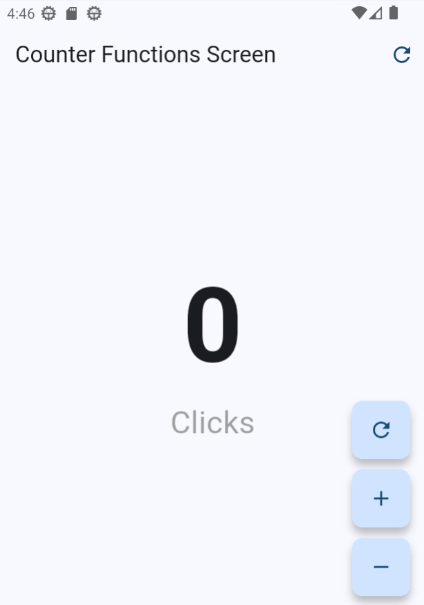

# Hello World Flutter

My first Flutter app created while following the course **Flutter - Móvil: De cero a experto** by `Fernando Herrera`.

<p align="center">
  
</p>

## Features

- **Counter Screen** - A simple counter with increment/decrement functionality
- **Counter Functions Screen** - Extended counter with additional actions in the app bar and floating action buttons
- Custom styled buttons with transparent and mini variants
- Responsive UI design

## Getting Started

This project is a starting point for a Flutter application.

### Prerequisites

- Flutter SDK installed
- Dart SDK
- Android Studio / VS Code with Flutter extensions

### Run the App

```bash
flutter pub get
flutter run
```

### Resources

A few resources to get you started if this is your first Flutter project:

- [Learn Flutter](https://docs.flutter.dev/get-started/learn-flutter)
- [Write your first Flutter app](https://docs.flutter.dev/get-started/codelab)
- [Flutter learning resources](https://docs.flutter.dev/reference/learning-resources)

For help getting started with Flutter development, view the
[online documentation](https://docs.flutter.dev/), which offers tutorials,
samples, guidance on mobile development, and a full API reference.
